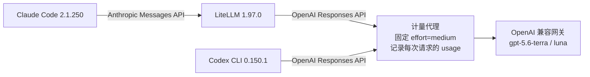

# Claude Code vs Codex CLI：同一模型下的效果与 Token 消耗对照实验

- **日期**：2026-09-16
- **标签**：Claude Code、Codex CLI、Token 成本、Agent Harness、对照实验
- **数据**：[`data/runs.csv`](data/runs.csv)（每次运行的指标）
- **复现脚本**：[`bench/`](bench/README.md)

## TL;DR

在**同一个模型（gpt-5.6-terra）、同一个上游网关、同一推理强度（medium）**下，用 5 个带隐藏测试的编程任务对比了三种配置：

| | Claude Code（默认） | Claude Code（仅 6 个核心工具） | Codex CLI |
|---|---|---|---|
| 隐藏测试通过 | 98/98 | 97/98 | 98/98 |
| 总输入 token | 1,135,617（2.42×） | 678,357（1.44×） | **469,990**（1×） |
| 未缓存输入 token | 124,642（1.71×） | 97,147（1.33×） | **73,028**（1×） |
| 输出 token | 18,360 | 17,929 | 17,811 |
| 总耗时 | 604 s（1.62×） | 446 s（1.20×） | **373 s**（1×） |

1. **效果打平**：这些任务上三者几乎都满分，工具（harness）的差异没有改变任务成败。
2. **Codex 最省**：Claude Code 默认配置的输入 token 是 Codex 的 2.4 倍，差距几乎全部来自**每次请求都会重发的固定前缀**（系统提示 + 工具定义，约 2.3 万 token，Codex 约 0.7 万）。输出 token 三者几乎一样。
3. **限制工具能收回大部分差距**：`--tools "Bash,Read,Edit,Write,Glob,Grep"` 让 Claude Code 的输入 token 减少 40%、耗时减少 26%。
4. **实际花费取决于缓存计费**：若缓存命中的输入按 10% 计费，Claude Code 约是 Codex 的 1.46 倍；若不打折，约 2.09 倍。

## 1. 背景

日常同时在用 Claude Code 和 Codex CLI，直观感受是 Claude Code 更“烧 token”。网上常见的“Claude Code 比 Codex 多耗 4 倍 token”大多是**不同模型**之间的比较（例如 Opus 对 GPT），模型和工具的影响混在一起。这次想回答两个问题：

1. 在**完全相同的模型**下，两个工具谁的效果更好、谁更省 token？
2. Claude Code 多出来的 token 是**架构本身**决定的，还是**配置问题**？

## 2. 实验环境

| 项目 | 说明 |
|---|---|
| 运行机器 | Linux 服务器（Rocky Linux 8），无外网，通过内网 OpenAI 兼容网关调用模型 |
| 模型 | `gpt-5.6-terra`（编程任务）、`gpt-5.6-luna`（固定开销测量） |
| Claude Code | 2.1.250，经 LiteLLM 1.97.0 把 Anthropic Messages API 转成 OpenAI Responses API |
| Codex CLI | 0.150.1，直连网关（Responses API） |
| 任务语言 | Python 3.12，标准库 `unittest` |

## 3. 控制变量

- **同一模型、同一上游**：两个工具的所有请求都经过同一个计量代理，再发往同一个网关。代理日志确认每次运行的所有请求（包括 Claude Code 的后台辅助请求）使用同一个模型。
- **同一推理强度**：Claude Code 按本地配置发出 `high`；Codex 本地默认是 `xhigh`，实验中用命令行参数设为 `medium`。计量代理把所有上游请求统一改写为 `medium`，并记录原始值。
- **统一的计量口径**：token 数取自上游返回的 `usage`（输入、缓存命中、输出、推理），不用工具自己报告的数字。代理不记录请求头和对话内容。
- **相同的任务与提示词**：每次运行都在全新的 git 仓库中进行；两个工具均为免审批模式；单次运行限时 15–20 分钟（实际都没有超时）。
- **干净的配置**：没有 MCP 服务、插件、全局 `CLAUDE.md`/`AGENTS.md`；Codex 关闭 memories 功能，并使用 `--ephemeral --ignore-rules`。
- **顺序**：每个任务轮流让不同工具先跑，减轻上游缓存预热带来的顺序偏差。
- **不信工具自述**：任务结束后才放入工具看不到的**隐藏测试**打分；参考答案先验证隐藏测试本身正确（参考答案全部通过、原始代码明显失败），验证后删除参考答案。

## 4. 测试任务

| 任务 | 类型 | 隐藏测试 | 原始代码能通过 | 说明 |
|---|---|---|---|---|
| T0_overhead | 固定开销 | – | – | 只回答 “OK”，测每次请求自带的前缀大小 |
| T1_ledger | 修 bug | 12 | 4 | 按 docstring 修复解析、日期区间、手续费四舍五入等 5 处 bug；禁止修改测试 |
| T2_durations | 按规格实现 | 9 | 0 | 实现 `parse_duration` / `format_duration`，含大量边界规则 |
| T3_shop | 跨文件加功能 | 11 | 0 | 给小型购物车包加优惠券：模型、购物车、报表、导出 |
| H1_spans | 找 bug + 性能 | 29 | 9 | 区间合并/排期库，6 处以上 bug + O(n²) 性能问题，含 5 个 10 万数据量的限时测试；禁止修改测试 |
| H2_calc | 跨模块扩展 | 37 | 3 | 表达式计算器：小数、右结合乘方、变量、函数，所有错误要给出精确的字符位置 |

## 5. 结果

### 5.1 固定开销（T0，每次请求都要携带）

| | 上游实测输入 token | 请求体大小 |
|---|---|---|
| Claude Code（默认） | 22,704 | 110 KB |
| Codex CLI | 6,876 | 35 KB |

用一个只记录请求、立即返回错误的假接口抓取第一次请求（不消耗 API token），再用 `o200k_base` 分词器拆分：

| 组成 | Claude Code（默认，21 个工具） | Claude Code（6 个核心工具） |
|---|---|---|
| 系统提示 | 5,824 | 5,672 |
| 工具定义 | **15,473** | **5,055** |
| 自动附加的说明 | 1,825 | 181 |
| 合计（估算） | ≈23,100 | ≈10,900 |

估算合计与上游实测（22,704）基本一致，说明 LiteLLM 的格式转换几乎不增加 token。占用最多的工具定义：Bash 2,655、Agent 1,912、Workflow 1,292、SendMessage 1,174、ScheduleWakeup 1,156、CronCreate 1,092、EnterWorktree 951、Read 647、ExitWorktree 608、ReportFindings 566、WebFetch 447、WebSearch 442。其中不少工具在这台无外网的服务器上根本用不到。

> Codex 的请求里没有单独的 `tools` / `instructions` 字段，说明和工具信息都在 `input` 中，所以只给出总量，没有拆分。

### 5.2 每个任务的结果

输入 token 总数 / 隐藏测试：

| 任务 | Claude Code（默认） | Claude Code（核心工具） | Codex CLI |
|---|---|---|---|
| T1 修 bug | 185k / 12/12 | 157k / 12/12 | **83k** / 12/12 |
| T2 按规格实现 | 146k / 9/9 | 68k / 9/9 | **51k** / 9/9 |
| T3 跨文件加功能 | 263k / 11/11 | 131k / 11/11 | **59k** / 11/11 |
| H1 找 bug + 性能 | 148k / 29/29 | **87k** / 29/29 | 107k / 29/29 |
| H2 跨模块扩展 | 393k / 37/37 | 234k / **36/37** | **170k** / 37/37 |

请求数、缓存、输出、推理 token、耗时和工具调用次数见 [`data/runs.csv`](data/runs.csv)。

### 5.3 汇总（T1–T3 + H1–H2）

| | Claude Code（默认） | Claude Code（核心工具） | Codex CLI |
|---|---|---|---|
| 隐藏测试 | 98/98 | 97/98 | 98/98 |
| 请求数 | 51 | 51 | 39 |
| 总输入 token | 1,135,617 | 678,357 | 469,990 |
| 其中缓存命中 | 1,010,975（89.0%） | 581,210（85.7%） | 396,962（84.5%） |
| 未缓存输入 | 124,642 | 97,147 | 73,028 |
| 输出 token | 18,360 | 17,929 | 17,811 |
| 其中推理 token | 3,931 | 4,492 | 4,262 |
| 总耗时 | 603.9 s | 446.0 s | 373.1 s |

### 5.4 成本估算

网关的实际计费规则未知，按两种假设估算（输出单价均按输入的 8 倍，以 Codex 为 1）：

| 假设 | Claude Code（默认） | Claude Code（核心工具） | Codex CLI |
|---|---|---|---|
| 缓存命中的输入按 10% 计费 | 1.46× | 1.17× | 1× |
| 缓存命中的输入不打折 | 2.09× | 1.34× | 1× |

## 6. 分析

### 6.1 为什么 Claude Code 更耗 token：主要是架构，其次是配置

**架构层面（主要原因）**

- Claude Code 的系统提示更详细，内置工具更多，而且每个工具都带大段使用说明；这部分前缀**每一轮请求都要重发**。
- Claude Code 倾向于用细粒度工具逐个读文件（例如 T3 调用 Read 11 次、发出 12 个请求），Codex 常用一条 shell 命令读多个文件（T3 只有 6 个请求）。轮次越多，大前缀被重复发送的次数越多。
- 这种设计本身是面向提示缓存的：缓存命中后单价很低，所以原始 token 数的差距会明显大于实际花费的差距。

**配置层面（放大因素）**

- 默认加载了许多在当前环境用不到的工具（子代理、定时任务、工作树、联网搜索等），约 1 万 token。限制为 6 个核心工具后，固定前缀从约 2.3 万降到约 1.1 万。
- 本地配置的推理强度是 `high`（实验中已统一为 `medium`，不影响对比，但会影响日常用量）。
- 使用超长上下文模型时，自动压缩历史的时机会推迟，长会话中每个请求携带的历史更多（推测，短任务中体现不出来）。
- 已排除：LiteLLM 转换基本不增加 token；环境中没有 MCP、插件或 `CLAUDE.md`。

### 6.2 效果

- 5 个任务中，默认 Claude Code 和 Codex 全部满分；两道较难的任务也没能拉开差距。
- 核心工具版在 H2 漏了一个边界情况：`min(4)` 只有一个参数时直接崩溃（Python 的 `min` 对单个非可迭代参数会报 `TypeError`）。单次运行无法据此判断“减少工具会降低效果”。
- 禁止修改测试文件的任务（T1、H1）中，所有工具都遵守了约束；T3、H2 中各工具都额外补充了测试。

## 7. 与网上已有对比的对照

| 来源 | 方法 | 结论 | 与本实验的关系 |
|---|---|---|---|
| [Systima（2026-07）](https://systima.ai/blog/claude-code-vs-opencode-token-overhead) | Claude Code 2.1.207 vs OpenCode，同模型（Sonnet 4.5），在 API 边界加记录代理 | 首次请求前缀 32.8k vs 6.9k（4.7×），工具定义约 24k；会话中前缀会变化，导致 3.6–8.6 万 token 的缓存重写；简单任务效果相同 | 方法最接近，结论一致；缓存重写问题本实验未测 |
| [note.com 日文文章](https://note.com/snake_dragon/n/ndacf0867110e?hl=en) | 整理 Reddit 社区用本地代理的测量 | 每次请求 Claude Code ≈27k、Codex ≈15k、Pi ≈2.6k | 未说明是否同模型；Codex 数值高于本实验的 6.9k |
| [Spectrum AI Lab（2026-07）](https://spectrumailab.com/blog/claude-code-vs-openai-codex-comparison-2026) | 追溯“4 倍差距”（Figma 转代码 6.2M vs 1.5M tokens）的来源 | 来自不同模型的对比（Opus 4.6 vs GPT-5.3），单个任务 | 模型与工具的影响混在一起，不是受控实验 |
| [VibeCafé（2026-04）](https://vibecafe.ai/blogs/claude-code-vs-codex-vs-opencode-real-comparison) | 数百名开发者 30 天真实用量 | Codex 用户人均月消耗反而更高（会话更长），两者缓存命中率都在 90% 以上 | 单任务更省不等于总花费更少 |
| [VibeCafé（2026-07）](https://vibecafe.ai/blogs/opencode-vs-claude-code) | 真实用量：OpenCode vs Claude Code | OpenCode 少 20% token，但缓存命中率 67% vs 91%，账单差距小得多 | 与“实际成本取决于缓存”一致 |
| [anthropics/claude-code #52979](https://github.com/anthropics/claude-code/issues/52979)、[#46526](https://github.com/anthropics/claude-code/issues/46526) | 用户反馈 | 简单提问也消耗 2–3 万 token；系统开销每轮重发 | 属于已知问题 |

没找到同时满足“同模型、同上游、统一推理强度、隐藏测试打分、Claude Code 直接对比 Codex”的公开实验，也没找到对“只加载核心工具”的量化测试。

## 8. 局限性

- 每个任务每种配置只跑了 1 次，结果有随机性。
- 任务是小型的构造任务，模型能力足够强时容易全部满分，区分不出效果差异。
- 只测了一个模型、一种推理强度；换模型或推理强度后比例可能不同。
- Claude Code 走的是 GPT 模型 + LiteLLM 转换，不能直接推广到使用 Anthropic 模型和原生缓存的情况。
- 上游缓存命中有波动（例如 H2 中核心工具版的缓存命中率明显偏低），所以“未缓存输入”这一项噪声较大，总输入 token 更稳定。
- 大型真实项目中，子代理、任务规划等被移除的工具可能更有价值，本实验没有覆盖。

## 9. 建议

- **最看重 token 与成本**：同一后端下优先用 Codex CLI。
- **习惯 Claude Code 的工作方式**：日常默认加上 `--tools "Bash,Read,Edit,Write,Glob,Grep"`（按需补充工具），并按任务难度调低推理强度；避免挂载用不到的 MCP 服务和过大的说明文件。
- **比较工具时**：尽量固定模型与推理强度，在 API 边界统一计量，并分开看总输入、未缓存输入和输出。

## 10. 复现

脚本、任务和隐藏测试都在 [`bench/`](bench/README.md)。整个实验共消耗约 231 万输入 token（大部分命中缓存）和 5.4 万输出 token，所有运行耗时合计约 25 分钟。

## 附：测量过程中修正的问题

- **计量窗口重叠**：最初打分时每次运行的时间窗口前后各多留了 1 秒，紧挨着的两次同类运行会把下一次的第一个请求算进上一次（影响了 6 次运行，例如 T2 的 Codex 由 6 个请求/59,240 token 修正为 5 个请求/50,628 token）。改为严格使用运行起止时间后重新打分，本文数字均为修正后的结果。
